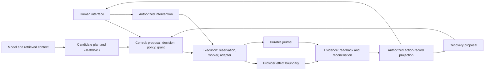
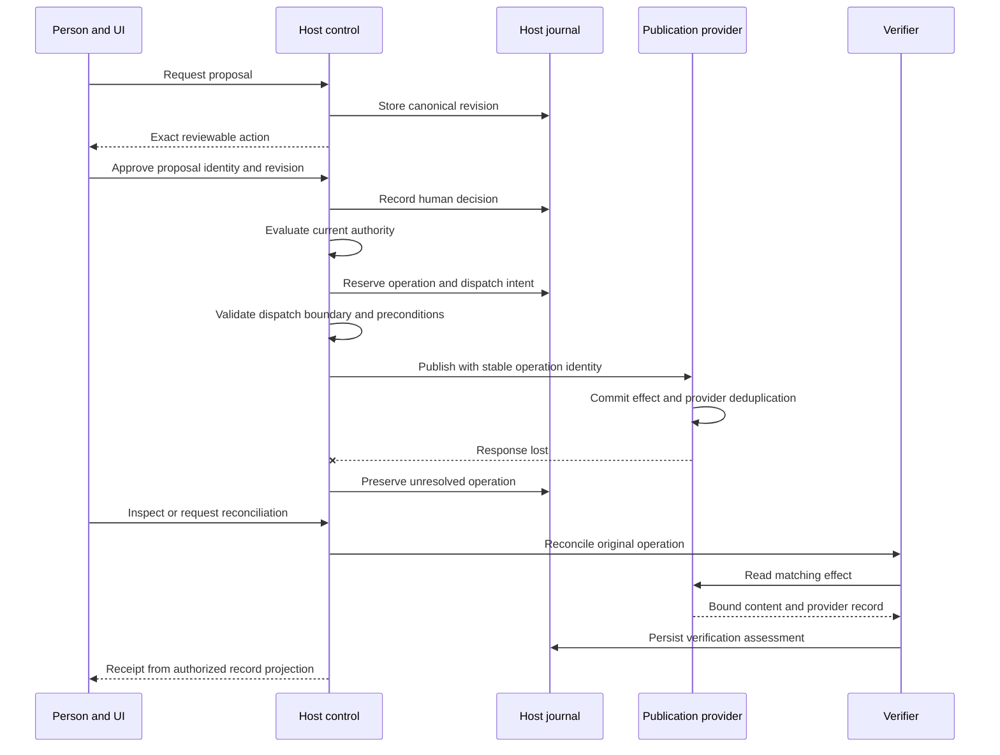

# TUN Systemic Engineering — Reference Architecture

Status: proposed architecture, with a narrower local host/provider slice implemented in the [pilot](PILOT.md).

[Documentation index](README.md) · [Components](COMPONENTS-v0.1.md) · [Contracts](CONTRACTS-v0.1.md) · [Threat model](THREAT-MODEL.md)

## Three responsibilities

The architecture separates control, execution, and evidence. They may run in one application; the separation identifies who is trusted to make each claim.

Model output is candidate data. Effectful credentials remain behind host enforcement. A presentation component can request a decision, but only the host can authorize dispatch.

## Trust boundaries

| Boundary | Incoming material | Owning enforcement |
|---|---|---|
| Person/client → host | Intent, decision references, control requests | Authentication, object access, request validation, CSRF/origin protection appropriate to transport |
| Model/context → host | Candidate plan, parameters, retrieved instructions | Input validation, source labeling, material classification, no permission inheritance |
| Host → worker | Operation and bounded grant references | Authentic producer, current authority, actor/scope binding, reservation ownership |
| Worker → provider | Canonical action and credentials | Adapter contract, parameter binding, duplicate protection, resource preconditions |
| Provider → evidence service | Responses, callbacks, readback | Source authenticity, operation correlation, freshness, claim scope |
| Journal → interface | Action and evidence projections | Viewer access, redaction, safe URLs, truthful state mapping |

The host includes its trusted identity and policy integrations. Calling a component “host-side” does not by itself secure it; deployment boundaries, credentials, and storage permissions must enforce the design.

## Publication sequence

If the host crashes before recording “unresolved,” the durable dispatch reservation already marks work whose outcome needs reconciliation. Startup does not treat that reservation as permission to execute again.

## Local atomicity and the remote gap

A host transaction can bind a proposal, decision, grant, and operation reservation in its own database. A transactional outbox can make dispatch intent durable. Neither makes a remote provider effect part of the host transaction.

The publication pilot should use separate host and provider stores. In the provider, the effect and its duplicate-protection record are committed together, with parameter comparison for repeated keys. The host verifies by readback from that store.

Production adapters need their own evidence for the provider's key scope, retention, lookup consistency, and error semantics. Some providers cannot offer those guarantees. Such adapters need narrower capabilities and an escalation path for ambiguity.

## Concurrency, worker ownership, and revocation

Use an atomic operation claim or equivalent serialization to avoid two workers dispatching fresh attempts. The claim includes the expected operation revision and worker generation.

A lease expiring does not establish that an earlier worker stopped. Fencing requires support at the point where a stale worker could cause an effect, or another duplicate-effect safeguard. If that boundary cannot be controlled, unresolved work remains blocked for reconciliation.

Define the ordering between revocation and dispatch reservation. Recheck permissions and preconditions at the chosen boundary; document the residual window before provider acceptance. Once accepted, cancellation depends on provider behavior. The UI reports those limits.

## Evidence and projections

### Implemented local dispatch boundary

The v0.3 [supervision slice](LOCAL-SUPERVISION-PILOT.md) distinguishes a reserved queue entry from a committed dispatch claim. Reserved work is known to be uninvoked in this host; attempted work can be uncertain after a crash.

Cancellation and dispatch serialize through the same host write transaction. Cancellation atomically records the terminal queue state, ended attempt, and control evidence. Dispatch atomically records ownership, consumes one configured dispatch-budget slot, and links the attempt to that budget revision before invoking the provider.

This narrows the local race without closing the provider gap. A crash between dispatch claim and invocation retains the spent slot and unresolved action. Historical control evidence never replaces provider readback.

The journal records facts and assessments with producer and causal references. The action projection combines them for a particular operation. Verification does not overwrite raw observations; it explains which claim they support and what remains unresolved.

Receipts and audit views are different access-filtered projections. A viewer may be entitled to the action status without seeing its private source content. Evidence links need access enforcement when followed, not just when generated.

## Intervention and recovery

Intervention can prevent new dispatch, pause a worker at a checkpoint, or request provider cancellation. Each control has an explicit effect and an observed result. It does not undo completed writes.

Reconciliation gathers evidence. Correction, withdrawal, compensation, and restoration return through the control plane as new linked operations. A retry remains within the original logical operation and uses renewed authority where necessary.

The [supervision guide](SUPERVISION-AND-RECOVERY-v0.1.md) defines the control lifecycle and boundaries.

## First implementation boundary

Start with one host process, a durable journal, one local provider, and a presentation adapter. The design repository already contains a [bounded Python/SQLite pilot](https://github.com/kochrisdev/TUN-Systemic-Design/blob/81b52e8d64c90891ef1340802502e398dc6c0340/examples/host-integration/README.md) that can inform implementation. It is a separate example and has not been tested against this engineering draft.

First establish proposal binding, authority checks, persistence, a lost-response path, and readback. Then add control and recovery cases. Multi-region coordination, remote provider resilience, and multi-agent orchestration need later scoped validation.

## Operational responsibilities

The application owner sets service objectives for authorization availability, dispatch delay, unresolved-operation age, verification lag, and intervention response. Measure cost and retry budgets alongside correctness. Alerting should identify a responsible responder without exposing private payloads.

Recovery procedures cover database restore, provider reconciliation after outages, stale worker ownership, expired duplicate protection, and revoked credentials. Restoring an old host database can lose knowledge of newer provider effects; reconciling that gap precedes resuming writes.

Deployment and infrastructure choices remain open. The [integration checklist](INTEGRATION-CHECKLIST.md) records the decisions an adopter needs to make.
