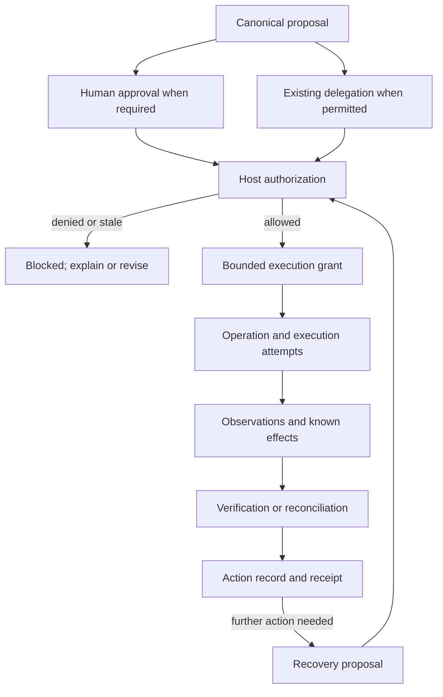

# TUN Systemic Engineering

## Concept Note v0.1

Status: draft concept for discussion

Revision: 1 October 2026

Companion: [TUN Systemic Design](https://github.com/kochrisdev/TUN-Systemic-Design)

[Project overview](../README.md) · [Documentation library](README.md) · [Manifesto](MANIFESTO-v0.1.md)

This note explains the rationale for an engineering model. Record names and examples are provisional; they are not a published API. The [draft specification](SPECIFICATION-v0.1.md) is the source of proposed requirements, while the [contracts](CONTRACTS-v0.1.md) develop the record semantics. The repository now also contains a [bounded local pilot](PILOT.md) and specialized experimental schemas, not a production runtime.

## 1. Purpose and initial scope

TUN Systemic Engineering aims to provide shared contracts and verification practices for AI products that act on behalf of people. Its central question is:

> What connects the person's intent, the system's authority, the attempted action, and the evidence of its outcome?

The initial focus is the boundary between a proposed action and its effects: approval, authorization, execution, observation, verification, intervention, and recovery. Intended users include product engineers, platform engineers, and teams integrating agents with tools and external services.

This is one part of AI product engineering. Model selection, retrieval quality, response evaluation, data quality, latency, cost, and product usefulness still need their own engineering and evaluation. A correctly authorized publication can contain a poor answer; evidence that it was published does not establish that its content is true.

The project builds on established application security and distributed-systems practices. Its proposed contribution is to connect those practices to a consistent human control contract and inspectable action history.

## 2. Problem and motivating example

A person approves publication of a project update. The host sends the approved content to a provider. The provider creates the publication, but the response is lost before the host records it.

The host knows that it attempted publication. It does not yet know the result. Reporting failure would suggest no effect occurred; retrying with a new operation identity could create a duplicate.

The intended behavior is to retain the approved proposal and operation identity, record the uncertainty, and reconcile the provider's authoritative records. If a matching publication is found, the system can verify that specific effect. If evidence remains unavailable, the receipt should continue to show an unresolved outcome.

Similar failures arise from changed proposals, concurrent requests, delayed execution, revoked permissions, partial completion, and cancellation races. The engineering model needs to preserve the distinctions that determine the next safe action.

## 3. Relationship to TUN Systemic Design

The [TUN Systemic Design specification](https://github.com/kochrisdev/TUN-Systemic-Design/blob/main/docs/SPECIFICATION-v0.1.md) already describes product behavior and host responsibilities for approval, authority, verification, and recovery. Its [reference architecture](https://github.com/kochrisdev/TUN-Systemic-Design/blob/main/docs/ARCHITECTURE.md) separates presentation from application enforcement.

TUN Systemic Engineering proposes reusable host contracts and validation scenarios for those responsibilities.

| Design responsibility | Proposed engineering support |
|---|---|
| Express intent and inspect context | Scoped intent and versioned context references |
| Review a proposal and approve it | Canonical proposal plus a separately recorded human decision |
| Understand who may act | Host authorization and bounded delegation |
| Observe activity | Operation, attempt, and effect records |
| Inspect an action receipt | Evidence-backed projection of known outcomes |
| Intervene in running work | Runtime control requests and confirmed control outcomes |
| Choose a recovery action | Reconciliation, retry, restoration, or compensation with explicit limits |

The engineering project should preserve the design project's distinction between autonomy and consequence. Neither an autonomy level nor a consequence label grants permission.

For actions governed by the design specification, C3 actions generally require explicit approval unless covered by intentional, bounded delegation. C4 actions require recorded approval of the particular proposal. The engineering proposal does not relax those requirements or require an approval dialog for every low-consequence operation.

Compatibility with the design components remains a pilot objective. These documents do not establish package or type compatibility.

## 4. Proposed lifecycle

Preparation establishes intent, context, and an approach. When an action is ready, the host creates a canonical proposal and evaluates how it may proceed.



The authorization of a recovery proposal includes any required human approval. A recovery label is never a permission bypass.

This diagram describes dependencies, not a mandatory sequence or one universal status. Observations may arrive before acknowledgements. Verification can continue after a worker stops. Receipts can show pending or unknown outcomes before verification finishes.

Keep these dimensions separate:

| Dimension | Examples of what it describes |
|---|---|
| Human decision | Approved, rejected, withdrawn |
| Authorization | Allowed or denied under a particular policy evaluation |
| Attempt lifecycle | Queued, running, ended |
| Effect knowledge | None established, partial, established, unknown |
| Verification | Pending, verified, contradicted, unavailable |
| Intervention | Requested, acknowledged, effective, failed |

These examples are vocabulary for discussion, not fixed enums. An ended attempt can still have an unknown effect. A denied new attempt says nothing about the effects of an earlier attempt.

Learning is a separate feedback process. Retaining workflow state, storing a preference, adding an evaluation case, and training a model have different purposes and permissions; they are not automatic consequences of completing an action.

## 5. Proposed records and ownership

The host is the application and its trusted services that enforce identity, policy, state, and execution. A model may suggest record contents; the host validates and accepts canonical records.

### Core action records

| Record | Purpose |
|---|---|
| `ActionProposal` | Immutable action revision: actor, target, material parameters, expected effects, preconditions, consequence, expiry, and recovery limits |
| `ApprovalDecision` | Authenticated human approval or rejection bound to the exact proposal revision and material fingerprint |
| `AuthorizationDecision` | Host allow/deny decision using current policy, identity, scope, and applicable approval or delegation |
| `ExecutionGrant` | Bounded host permission to dispatch a specific operation; it may be an internal record rather than a portable token |
| `OperationRecord` | Stable identity for one intended logical action across deliveries, attempts, and effects |
| `ExecutionAttempt` | One bounded invocation attempt, linked to its operation, grant, provider request identity, and observations |
| `VerificationRecord` | Assessment of a specific outcome claim, with evidence references, method, scope, time, and limitations |
| `ActionRecord` | Versioned aggregate of known effects, supporting records, unresolved questions, and available next actions |

Approval expresses the person's decision. Authorization establishes whether the host currently permits execution. A valid approval can coexist with a denied authorization after permission, policy, or preconditions change.

A receipt is an access-filtered view of the action record. Receipt generation cannot invent evidence, remove uncertainty, or confer authority. Updated evidence produces a new record revision while preserving the earlier assessment.

### Supporting records

- `IntentContract`: desired outcome, owner, scope, constraints, and stopping conditions.
- `ContextSnapshot`: versioned references to material context, provenance, and availability.
- `PlanRecord`: proposed approach and dependencies; review does not grant execution rights.
- `DelegationRecord`: permitted actions, targets, duration, budgets, and exception behavior.
- `ActivityObservation` and `EffectRecord`: what a source reports and which effects are known, including partial effects.
- `InterventionRequest`: requested control and evidence of its outcome.
- `RecoveryOperation`: a recovery action linked to the original operation and its own authorization.

Supporting records can begin as embedded structures in the pilot. Each record family does not need a separate service or package.

Record envelopes should identify schema version, record identity, producer, security scope, relevant timestamps, and causal references. A proposal's business revision is distinct from its schema version. IDs, timestamps, and fingerprints establish useful relationships only when their source and storage are trusted.

## 6. Engineering constraints

### 6.1 Enforce authority at the effect boundary

Authorization considers the authenticated principal, tenant or equivalent isolation scope, target, action, policy version, proposal revision, expiry, revocation, and required approval or delegation. A consequential dispatch is blocked when required checks cannot be completed.

The executor uses host-resolved parameters. A model's proposal, retrieved instruction, or client-supplied permission flag cannot grant authority. Effectful credentials and tools need enforcement paths that an agent cannot bypass.

The host revalidates authority and relevant preconditions before dispatch, including after a queue delay. Long workflows need further checks at appropriate action boundaries. Each grant names the permitted actor, action, target, operation, and validity limits.

Revocation has a defined enforcement point. Once a provider has accepted an action, stopping future dispatches may not stop its in-flight effects. The system documents that boundary and records what intervention actually achieved.

### 6.2 Bind approval to material content

The host defines an action-specific material field set and canonical representation. Material fields include anything that changes the approved meaning or consequences. Referenced content needs a version or digest; a mutable URL alone does not bind the reviewed content.

A material change creates a new proposal revision and invalidates the earlier approval for that changed action. Unrelated telemetry updates should not trigger new approval. Resource preconditions, such as the target revision, need checking at execution as well as review.

Canonical serialization can support reproducible fingerprints; [RFC 8785](https://www.rfc-editor.org/rfc/rfc8785) describes one JSON canonicalization scheme. A hash alone does not authenticate the approver, enforce permissions, or establish that source content is true.

### 6.3 Distinguish operations from attempts

An operation identifies the intended effect; an attempt identifies one invocation. Permitted retries of the same operation retain its idempotency identity and material parameters. A genuinely new intended action gets a new operation identity. A new identity must not be used to escape an unresolved earlier outcome.

The adapter declares key scope, retention, parameter mismatch handling, concurrency behavior, and any downstream effects excluded from its duplicate protection. These are concrete service properties: [AWS's retry guidance](https://aws.amazon.com/builders-library/making-retries-safe-with-idempotent-APIs/) discusses caller request identities and changed intent; [Stripe's API documentation](https://docs.stripe.com/api/idempotent_requests) documents retention and parameter-matching limits.

A local ledger cannot by itself make a remote write atomic with that ledger. The first pilot should test the crash window between provider commit and host acknowledgement. TUN should not claim universal exactly-once execution.

### 6.4 Reconcile unknown outcomes

After an ambiguous response, preserve the operation identity and known effects. Reconcile using authorized provider records or a documented equivalent mechanism.

An empty read from an eventually consistent system may not prove that no write occurred. Define a reconciliation window, evidence freshness, and an escalation path. If the result remains unresolved, retain the unknown state.

Any reissue requires current authority and a documented duplicate-effect safeguard that still applies to the original operation. Automatic retries should stop when that guarantee is absent, expired, or uncertain. Human approval of a retry does not establish that the original action had no effect.

### 6.5 Verify an explicit claim

A verification record states exactly what it assesses: provider acceptance, existence of the expected publication revision, delivery, or another declared effect. It binds evidence to the relevant operation, target, content, source, and observation time.

Use readback or provider evidence independent of the executor's success assertion where feasible. Independence of method does not require a separate service and does not eliminate shared provider failures.

An acceptance receipt can verify acceptance without proving delivery. Matching current state may not prove which operation created it; provider request or effect identifiers can support that attribution. Verification of publication also says nothing by itself about the truth of the published text.

### 6.6 Preserve history with controlled retention

Record dispatch intent before sending an effectful request. If that required durable write fails, do not dispatch. If recording the result fails after a provider effect, treat recovery as reconciliation of an unresolved operation.

Retain causal links, partial effects, and later corrections. Append-only event semantics do not require retaining all raw content forever or guarantee tamper resistance. Storage controls, integrity mechanisms, retention, and deletion behavior need explicit implementation choices.

Context snapshots may use immutable manifests that reference protected content. Deleting that content can make later replay or verification unavailable; the record should show that limitation. Do not copy sensitive prompts, credentials, or source material into every log to make a trace complete.

### 6.7 Make intervention and recovery real

Define which work can pause, stop, cancel, or transfer to a person, where each request takes effect, and how the outcome is confirmed. Acknowledgement is a request status, not evidence that work has stopped.

Recovery actions have distinct meanings:

| Action | Meaning |
|---|---|
| Reconcile | Establish what happened using available evidence |
| Retry | Attempt the same logical operation again under current authority and duplicate safeguards |
| Restore | Return the relevant state to a defined earlier condition, subject to current preconditions |
| Correct | Apply a new change that fixes an identified problem |
| Compensate | Apply another effect to offset an earlier one |
| Escalate | Transfer an unresolved decision to an authorized person or process |

Recovery reads require access permission. Recovery writes require their own applicable authorization and approval. Restoring a record may need to preserve subsequent edits; removing a publication cannot retract copies already received.

## 7. Reference architecture

Three logical responsibilities organize the proposed implementation:

| Plane | Owns | Supplies |
|---|---|---|
| Control | Identity integration, proposals, approval records, policy decisions, delegation, grants, revocation | Bounded permission or an explicit denial |
| Execution | Dispatch, tool adapters, attempt records, duplicate protection, resource limits, intervention handling | Observations and known effects |
| Evidence | Verification, reconciliation, action-record projection, authorized receipt views | Supported claims, unresolved results, and recovery recommendations |

These planes may share a process and database. The first implementation does not require microservices.

The evidence plane cannot independently authorize a corrective write. Recovery returns through control and execution. Intervention reaches the executor; its observed outcome returns through the evidence path.

Budgets cover time, retries, tool calls, and cost. Exhausting a budget stops further dispatch according to policy and preserves completed or unresolved effects.

## 8. Proposed validation

There is no conformance program or certification. The [draft specification](SPECIFICATION-v0.1.md), [validation plan](VALIDATION-PLAN-v0.1.md), and [conformance matrix](CONFORMANCE-MATRIX.md) now define proposed requirements and planned procedures. The local pilot exercises selected cases within those procedures; no complete requirement assessment is claimed. The following scenarios summarize the motivating acceptance cases.

| Scenario | Expected evidence |
|---|---|
| Content changes after approval | Earlier approval cannot authorize the changed revision |
| Permission expires while work is queued | Dispatch is denied, with the reason retained |
| Two workers receive one operation | Provider duplicate protection prevents an additional publication within its declared guarantee |
| Same key is reused with changed parameters | The request is rejected rather than silently adopting either payload |
| Provider commits but response is lost | Outcome remains unresolved until reconciliation; no unguarded second write |
| Host restarts after dispatch | Original operation and uncertainty survive restart |
| Only some effects occur | Partial effects remain in the action record |
| Stop races with provider acceptance | Control status and completed or in-flight effects are reported separately |
| Evidence refers to a different revision | It cannot verify the current claim |
| Another tenant requests a receipt | Unauthorized evidence and content are not returned |
| Duplicate-protection retention has elapsed | Replay is blocked unless a safe alternative is established |
| Compensation fails | Original and compensating effects remain separately inspectable |

A future conformance claim should identify the specification version, applicable requirements and justified exclusions, implementation revision, adapter guarantees, test evidence, and limitations. Passing tests would establish only the tested scope. Adoption labels can be decided after that scope exists.

## 9. First pilot and acceptance criteria

Start with a local publication provider that persists real records and exposes a readback endpoint. Use fixture identities and content, with no public publishing integration. A person can author the proposal; an LLM is optional because the pilot is testing the action contract.

The pilot should support:

1. Preparing and reviewing a canonical publication proposal.
2. Recording approval separately from host authorization.
3. Binding a grant and stable operation identity to the approved content.
4. Publishing through a provider that durably enforces duplicate protection.
5. Deliberately losing the acknowledgement after provider commit.
6. Restarting the host and reconciling by the original operation identity.
7. Verifying the target and content revision, then projecting a truthful receipt.
8. Requesting a separately authorized correction or withdrawal with disclosed limits.

The milestone is complete when a repeatable run demonstrates exactly one persisted publication for the tested operation, preserved state across restart, a blocked stale approval, and a receipt supported by readback evidence. If readback is unavailable, the receipt remains unresolved.

A short recorded walkthrough and reproducible failure fixtures should accompany the result. This establishes behavior for the local provider; an external adapter needs separate validation of its own guarantees.

The first experimental slice uses Python, JSON Schema, and separate SQLite stores. Its [pilot guide](PILOT.md) distinguishes implemented behavior from missing UI, recovery, and production features. TypeScript bindings remain a possible later addition.

## 10. Development sequence

The [glossary](GLOSSARY.md), draft requirements, record semantics, lifecycle rules, and planned validation procedures are documented. Specialized schemas, publication/readback, separately approved correction/withdrawal, and a two-component local React interface now exist. General contracts, richer supervision, production integration, and full assessment remain open. The [status and roadmap](STATUS-AND-ROADMAP.md) tracks those distinctions.

| Milestone | Deliverable | Exit condition |
|---|---|---|
| Vocabulary | Glossary, record relationships, action and evidence definitions | Approval, authorization, operation, attempt, and outcome have distinct meanings |
| Executable contracts | Schemas and validators implementing the draft record and lifecycle rules | Valid and invalid fixtures exercise cross-record bindings |
| Publication pilot | One reference host, provider, and design-component adapter | The acceptance criteria in section 9 are reproducible |
| Failure coverage | Crash, race, privacy, and recovery scenarios | Declared guarantees have supporting results and explicit gaps |
| Portability | A second adapter and integration guidance | Shared contracts survive different provider semantics without hiding limitations |

Keep a small repository layout. The documentation and checker exist; create implementation directories only when their contents exist:

```text
docs/                       Engineering documentation library (present)
scripts/                    Documentation checker (present)
schemas/                    Experimental pilot schema and fixtures (present)
reference/                  Python/SQLite publication and readback pilot (present)
tests/                      Focused pilot tests (present)
conformance/                Future complete assessment runner
```

Split reusable packages only when a second integration establishes a useful boundary. A model SDK, workflow engine, identity provider, and policy engine can be integrated through adapters.

## 11. Open decisions

The pilot should resolve:

- Which fields and context changes are material for each action?
- How are content digests, resource versions, and preconditions bound together?
- Which guarantees can each provider actually enforce across retries and crashes?
- How are late observations, contradictions, and receipt revisions represented?
- When does an unresolved operation require human escalation?
- How are workflow authority and budgets renewed explicitly?
- What evidence can be retained while respecting content deletion and access rules?

The draft establishes constraints for these decisions, not a universal provider implementation. Pilot-specific choices should produce examples, recorded rationale, and evidence before the draft requirements are stabilized.

## 12. Intended outcome

A team adopting the eventual contracts should be able to inspect an action and determine its purpose, exact proposal, approver where required, authorization basis, execution attempts, known effects, supporting evidence, and recovery options.

The first useful result is a working, narrowly tested publication workflow. Its claims should remain proportional to its evidence. Broader AI quality and product evaluation can then connect to that foundation without confusing successful execution with a successful product.
